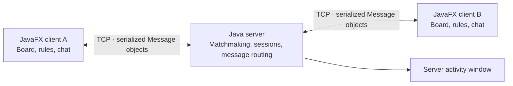

# Networked Checkers

**A JavaFX checkers game with multiplayer matchmaking, a computer opponent, and built-in chat.**

Play a friend through a dedicated Java socket server or practice against a capture-first bot. The desktop client combines a custom-styled board, move history, session scores, and English/Spanish controls.

**Java · JavaFX · TCP sockets · Multithreading · Maven**

## Play

- **Multiplayer:** join a matchmaking queue, get paired with another player, and exchange moves through the server.
- **Single player:** face a bot that prioritizes captures and chooses randomly among available moves.
- **Checkers rules:** diagonal moves, mandatory captures, chained jumps, and king promotion, with visual hints for available moves.
- **Match flow:** waiting screens, turn indicators, capture scores, move logs, win/loss displays, forfeits, and rematch requests.
- **Messaging:** chat with your opponent during a game, or use broadcast, direct, and group messaging from the lobby.
- **Language switching:** change between English and Spanish from the interface.

## How it works



The server accepts connections on port **6767** and creates a thread for each connected client. A matchmaking queue pairs players, assigns light and dark pieces, and establishes the opponent relationship. Moves are relayed to the paired client; rematches and disconnects have separate message types.

The client keeps its own board state and applies local and received moves. Networking callbacks update the interface through `Platform.runLater`, keeping UI changes on the JavaFX application thread. Callbacks connect the board to networking, navigation, chat, and match results.

### Code map

| File | Responsibility |
| --- | --- |
| [CheckersGui.java](HW5Client/src/main/java/CheckersGui.java) | Board rendering, move rules, capture chains, promotion, bot turns, and game overlays |
| [GuiClient.java](HW5Client/src/main/java/GuiClient.java) | Sign-in, lobby, scene navigation, language selection, and incoming-message handling |
| [Client.java](HW5Client/src/main/java/Client.java) | Socket connection, background message receiving, and sending |
| [Server.java](HW5Server/src/main/java/Server.java) | Client threads, matchmaking, rematches, message routing, and disconnect handling |
| [GuiServer.java](HW5Server/src/main/java/GuiServer.java) | Server launch and activity log window |
| [Message.java](HW5Client/src/main/java/Message.java) | Serializable message protocol, mirrored in the server module |

## Run locally

Use **JDK 17 or newer**, Maven, and a desktop environment. The project uses JavaFX **19.0.2.1**; Maven resolves its dependencies and platform libraries.

Clone the repository and open a terminal in its root:

```sh
git clone https://github.com/KhangN65719/Networked-Checkers.git
cd Networked-Checkers
```

**1. Start the server:**

```sh
mvn -f HW5Server/pom.xml compile org.openjfx:javafx-maven-plugin:0.0.8:run -Djavafx.mainClass=GuiServer
```

**2. Start a client in another terminal:**

```sh
mvn -f HW5Client/pom.xml compile org.openjfx:javafx-maven-plugin:0.0.8:run -Djavafx.mainClass=GuiClient
```

**3. Play:**

Enter a unique username, then choose **Single Player** or **Multiplayer**. To try multiplayer locally, launch the client command in a third terminal, sign in with a different username, and choose Multiplayer in both windows.

The client currently connects to `127.0.0.1:6767`. Start the server even for single-player mode, because sign-in uses the server connection. The module directories retain their existing names so the build paths remain stable.

## Engineering choices

- **TCP and typed messages:** one connection carries matchmaking events, moves, and chat using Java object serialization.
- **Separate client and server applications:** the same server coordinates multiple connected clients and routes messages to the appropriate recipients.
- **Client-side rules:** immediate move highlighting and validation live alongside the board. The server acts as a relay rather than an authoritative rules engine.
- **Simple bot strategy:** capture-first random selection provides a playable opponent without claiming search-based or machine-learning AI.
- **Session-only records:** scores and win/loss counters are held in memory rather than persisted as player accounts.

## Current scope

This version is intended for local demonstrations with trusted clients. Usernames are session identifiers, not authenticated accounts; transport is unencrypted, and the server does not independently validate moves. Public hosting would require changes to authentication, message validation, and game-state ownership.

Both modules were verified to compile with Maven during repository preparation. The existing test files contain a deliberate `fail("Not yet implemented")` placeholder, so `mvn test` is not a passing gameplay suite. Automated rules tests, configurable connection settings, and authoritative server-side validation are useful next improvements.
